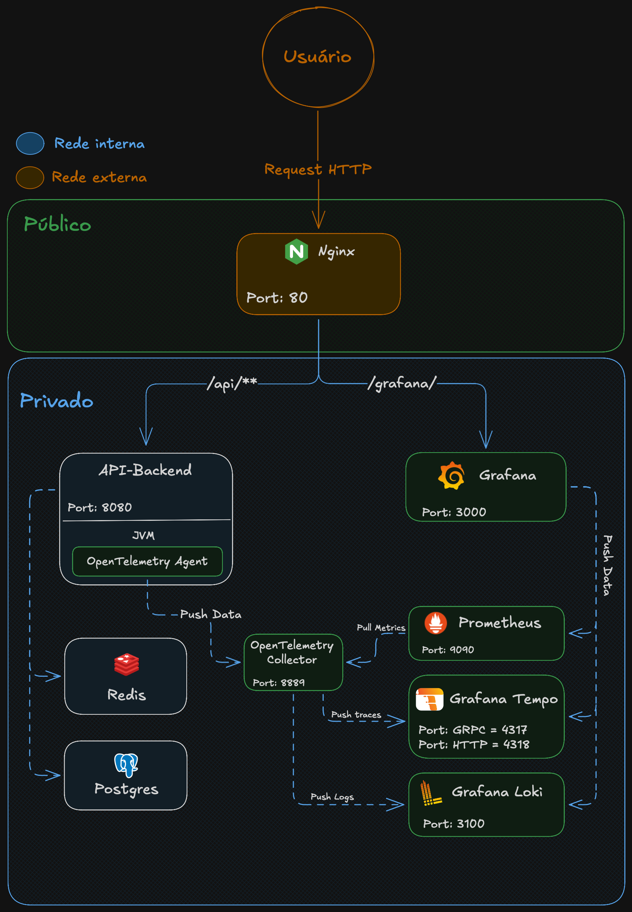
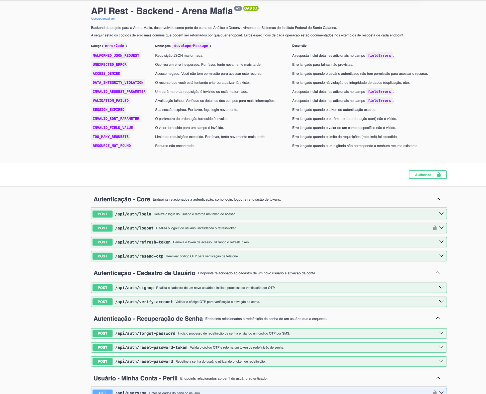

# Arena Mafia - Sistema de Agendamento de Quadras Esportivas

> Uma aplicação moderna de agendamento de quadras esportivas desenvolvida como projeto de extensão universitária no IFSC. 
> Construída com arquitetura hexagonal, Spring Boot 3.5 e observabilidade em tempo real com OpenTelemetry.

## 🎯 Visão Geral

**Arena Mafia** é uma solução completa para gerenciar agendamentos de quadras esportivas (tênis, vôlei, badminton, etc.). A aplicação oferece:

✅ **Autenticação e Autorização** - Sistema JWT com refresh tokens  
✅ **Gestão de Usuários** - Perfis de administrador e cliente  
✅ **Agendamento Inteligente** - Suporte a modalidades, quadras, horários e preços dinâmicos  
✅ **Preços Variáveis** - Regras de preço por período, horário e modalidade  
✅ **Observabilidade Completa** - Traces distribuído, logs centralizados e métricas em tempo real  
✅ **API RESTful Documentada** - OpenAPI 3.1 com Swagger UI integrado

---

## 🏗️ Arquitetura

### Diagrama da Arquitetura



### Arquitetura Hexagonal (Ports & Adapters)

A aplicação segue rigorosamente o padrão de **Arquitetura Hexagonal**, garantindo:
- **Independência de Frameworks**: O domínio é totalmente desacoplado de Spring, JPA e outras dependências externas
- **Testabilidade**: Cada camada pode ser testada isoladamente
- **Manutenibilidade**: Código organizado e previsível
- **Escalabilidade**: Fácil adicionar novos adapters e ports

#### Estrutura de Camadas

```
src/main/java/com/projetoExtensao/arenaMafia/
├── domain/                          # Domínio (Regras de Negócio)
│   ├── model/                       # Entidades de negócio
│   ├── valueobjects/                # Value Objects (conceitos imutáveis)
│   ├── exception/                   # Exceções customizadas de domínio
│   └── /* Policies e Validators */
│
├── application/                     # Aplicação (Use Cases)
│   ├── agenda/                      # Use cases de agenda
│   ├── auth/                        # Use cases de autenticação
│   ├── court/                       # Use cases de quadras
│   ├── modality/                    # Use cases de modalidades
│   ├── priceRule/                   # Use cases de regras de preço
│   ├── schedule/                    # Use cases de agendamentos
│   ├── user/                        # Use cases de usuários
│   ├── {feature}/
│   │   ├── usecase/                 # Interfaces dos casos de uso
│   │   └── imp/                     # Implementações dos casos de uso
│   └── security/                    # Portas de segurança
│
└── infrastructure/                  # Infraestrutura (Adapters)
    ├── adapter/                     # Adaptadores das Portas
    ├── config/                      # Configurações Spring
    ├── persistence/                 # JPA Repositories (adaptam a porta do repositório)
    ├── security/                    # Spring Security (autenticação/autorização)
    └── web/                         # REST Controllers (adaptam as portas de entrada)
```

### Fluxo de Dados

```
HTTP Request
     ↓
[Controller] (Infrastructure)
     ↓
[Use Case] (Application)
     ↓
[Entity] (Domain) - Lógica de Negócio
     ↓
[Port] (Application) - Abstração
     ↓
[Adapter] (Infrastructure) - Implementação Concreta
     ↓
[Banco de Dados / Serviço Externo]
```

---

## 💻 Tecnologias

### Backend
- **Java 21** - Linguagem principal
- **Spring Boot 3.5.4** - Framework web
- **Spring Security** - Autenticação e autorização
- **Spring Data JPA** - Persistência de dados
- **Flyway 11.10.2** - Versionamento de banco de dados
- **MapStruct 1.5.5** - Mapeamento entre DTOs e entidades
- **PostgreSQL** - Banco de dados principal
- **Redis** - Cache e sessions distribuídas
- **OpenTelemetry** - Observabilidade (traces, logs, métricas)

### Infraestrutura & DevOps
- **Docker** - Containerização
- **Docker Compose** - Orquestração local
- **Nginx** - Proxy reverso
- **OpenTelemetry Collector** - Centralização de observabilidade

### Observabilidade
- **Prometheus** - Coleta de métricas
- **Grafana** - Visualização de métricas
- **Tempo** - Armazenamento de traces distribuídos
- **Loki** - Agregação de logs
- **OpenTelemetry Java Agent** - Instrumentação automática

### Testes
- **JUnit 5** - Framework de testes
- **Mockito** - Mocking de dependências
- **AssertJ** - Asserções fluentes
- **TestContainers** - Containers Docker para testes de integração
- **REST Assured** - Testes de API REST

---

## 📁 Estrutura do Projeto

```
.
├── src/
│   ├── main/
│   │   ├── java/com/projetoExtensao/arenaMafia/
│   │   │   ├── domain/                 # Camada de Domínio
│   │   │   ├── application/            # Camada de Aplicação
│   │   │   └── infrastructure/         # Camada de Infraestrutura
│   │   └── resources/
│   │       ├── application.yml         # Configurações padrão
│   │       ├── application-dev.yml     # Configurações dev
│   │       ├── application-prod.yml    # Configurações prod
│   │       ├── db/migration/           # Scripts Flyway
│   │       └── static/docs/            # Documentação OpenAPI
│   └── test/
│       ├── java/                       # Testes (Unit + Integration)
│       └── resources/
│           └── application-test.yml    # Configurações para testes
│
├── config/                              # Configurações de infraestrutura
│   ├── otel-collector-config.yml        # OpenTelemetry Collector
│   ├── prometheus.yml                   # Prometheus
│   ├── loki.yml                         # Loki
│   ├── tempo.yml                        # Tempo
│   └── grafana/                         # Grafana dashboards
│
├── gateway/
│   └── nginx.conf                       # Nginx reverse proxy
│
├── docker-compose.yml                   # Compose principal (prod)
├── docker-compose.override.yml          # Overrides para dev
├── Dockerfile                           # Build da imagem
├── pom.xml                              # Maven config
├── LICENSE                              # Licença
└── README.md                            # Este arquivo
```

---

## 📊 Observabilidade

### OpenTelemetry (Unified Observability)

A aplicação implementa observabilidade completa com **OpenTelemetry**:

#### Componentes
- **Java Agent**: Instrumentação automática via `opentelemetry-javaagent.jar`
- **OTel Collector**: Centraliza e processa traces, logs e métricas
- **Prometheus**: Coleta de métricas (Pull Model)
- **Tempo**: Armazenamento de traces distribuídos
- **Loki**: Agregação centralizada de logs
- **Grafana**: Visualização unificada

#### Fluxo de Dados

```
Java Application (Instrumented by Agent)
        ↓ (gRPC - OTLP)
OTel Collector
    ↙     ↓     ↘
Prometheus  Tempo  Loki
    ↓       ↓     ↓
  Grafana (Unified Dashboard)
```

### Acessar Dashboards

**Grafana** (Visualização unificada)
- Dashboards pré-configurados:
  - **Spring Boot Observability** - Métricas da aplicação
  - **JVM Micrometer** - Métricas da JVM

## 🧪 Testes

### Estrutura

```
src/test/java/com/projetoExtensao/arenaMafia/
├── integration/                     # Testes de Integração
│   └── config/
│       ├── WebIntegrationTestConfig.java
│       └── BaseTestContainersConfig.java
└── unit/                            # Testes Unitários
```

### Padrão AAA (Arrange-Act-Assert)

```java
@Test
@DisplayName("Deve criar um novo usuário com sucesso")
void shouldCreateUserSuccessfully() {
    // Arrange - Preparação
    CreateUserRequest request = new CreateUserRequest("user@example.com", "password123");
    
    // Act - Execução
    UserResponse response = createUserUseCase.execute(request);
    
    // Assert - Verificação
    assertThat(response.id()).isNotNull();
    assertThat(response.email()).isEqualTo("user@example.com");
}
```

### Testes de Integração com REST Assured

```java
@DirtiesContext(classMode = DirtiesContext.ClassMode.AFTER_CLASS)
@DisplayName("Testes de Integração para UserController")
public class UserControllerIntegrationTest extends WebIntegrationTestConfig {
    
    @BeforeEach
    void setup() {
        super.setupRestAssured();
        specification = new RequestSpecBuilder()
            .setBasePath("/api/users")
            .setContentType(MediaType.APPLICATION_JSON_VALUE)
            .build();
    }
    
    @Test
    @DisplayName("POST /api/users - Deve criar usuário com sucesso (201)")
    void shouldCreateUserSuccessfully() {
        var response = given()
            .spec(specification)
            .body(new CreateUserRequest("user@example.com", "password123"))
            .when()
            .post()
            .then()
            .statusCode(201)
            .extract()
            .as(UserResponse.class);
        
        assertThat(response.id()).isNotNull();
    }
}
```

---

## 📚 Documentação da API

### Swagger UI



### Especificação OpenAPI

```
/static/docs/openapi.yml
```

Estrutura:
```
docs/
├── openapi.yml              # Arquivo principal
├── components/
│   ├── schemas/             # DTOs (Request/Response)
│   ├── parameters/          # Parâmetros reutilizáveis
│   ├── responses/           # Respostas de erro comuns
│   └── headers/             # Headers HTTP
└── paths/                   # Definição dos endpoints
```

---

## 🔐 Segurança

### Autenticação JWT

```bash
# 1. Login
curl -X POST http://localhost:8080/api/auth/login \
  -H "Content-Type: application/json" \
  -d '{
    "username": "user@example.com",
    "password": "password123"
  }'

# Resposta:
# {
#   "accessToken": "eyJhbGc...",
#   "refreshToken": "eyJhbGc..."
# }

# 2. Usar Access Token
curl -X GET http://localhost:8080/api/users/me \
  -H "Authorization: Bearer eyJhbGc..."
```

### Refresh Token

```bash
curl -X POST http://localhost:8080/api/auth/refresh \
  -H "Content-Type: application/json" \
  -d '{
    "refreshToken": "eyJhbGc..."
  }'
```

---

### Guideline de Commits

```
<tipo>(<escopo>): <subject>

<body>

<footer>
```

**Tipos:**
- `feat`: Nova funcionalidade
- `fix`: Correção de bug
- `docs`: Documentação
- `style`: Formatação, semântica (sem mudança de código)
- `refactor`: Refatoração de código
- `test`: Adição ou atualização de testes
- `chore`: Build, dependências, tooling

**Exemplo:**
```
feat(user): adicionar endpoint de perfil de usuário

- Implementa GET /api/users/me
- Adiciona testes de integração
- Documenta no OpenAPI

Closes #123
```

---

## 📝 Licença

Este projeto é licenciado sob a [MIT License](LICENSE).

---

## 👥 Autores

Projeto desenvolvido como iniciativa de extensão universitária no **Instituto Federal de Santa Catarina (IFSC)**.

